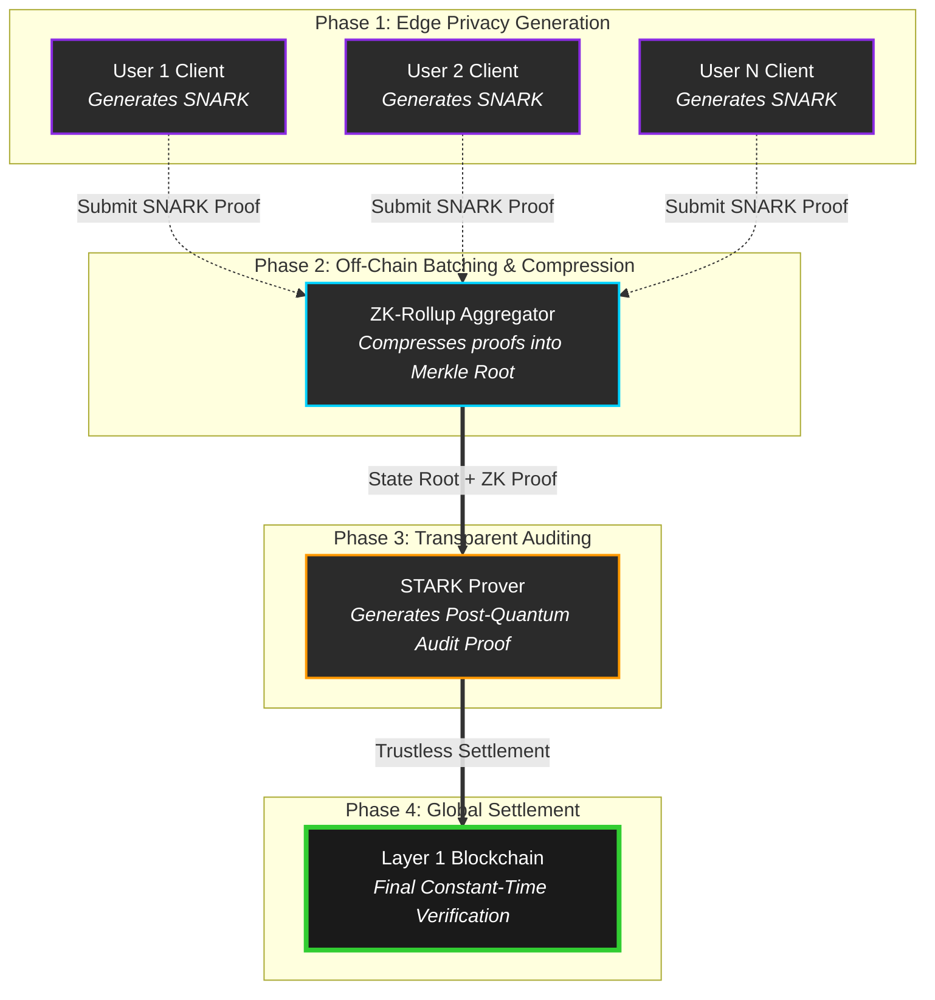

<div align="center">

# 🛡️ Hybrid Zero-Knowledge Proof (ZKP) Verification Framework
**Next-Generation Secure, Scalable, and Low-Cost Batch Verification Pipeline**

[](https://zkp-dashboard-c5xe.vercel.app/)
[](https://opensource.org/licenses/MIT)
[](https://www.python.org/)
[](#)
[](https://ethereum.org/)

*An authoritative, open-source demonstration of orchestrated zk-SNARK, zk-STARK, and zk-Rollup cryptographic primitives designed for the modern decentralized web.*

> ### 🚀 **[Access the Live Interactive Demo Here: zkp-dashboard-c5xe.vercel.app](https://zkp-dashboard-c5xe.vercel.app/)**
> *Interact with the hybrid framework in real-time. No setup required.*

---
</div>

## 📑 1. Abstract & Academic Publication

This repository serves as the official open-source codebase for the academic research paper presented at the 2026 International Conference. It introduces a novel Hybrid ZKP Verification Pipeline that addresses the blockchain "Trilemma"—balancing privacy, scalability, and transparency without compromising security.

> **Conference:** International Conference on Network Technologies and Computational Security (ICNTCS-26) - *Virtual*  
> **Paper ID:** SFE 23567  
> **Status:** Proceeding published; an *Extended Journal Version* is currently in preparation.

---

## 🔬 2. The Cryptographic Trilemma Addressed

Our framework solves inherent limitations in isolated Zero-Knowledge systems by orchestrating them into a cohesive pipeline. 

### 🔐 zk-SNARKs (Zero-Knowledge Succinct Non-Interactive Argument of Knowledge)
*   **Role in Pipeline:** Operates at the very edge (User Layer) to provide absolute data privacy.
*   **Mechanism:** Generates tiny, computationally cheap proofs verifying a user's eligibility (e.g., Credit Score, Identity) without ever exposing the underlying sensitive dataset.
*   **Trade-off Solved:** Requires a trusted setup, which we mitigate by restricting SNARKs solely to individual user-level claims.

### 🚄 zk-Rollups (Scalability Engine)
*   **Role in Pipeline:** Operates at the Mid-Layer to slash transaction / settlement costs.
*   **Mechanism:** Aggregates thousands of individual SNARK proofs off-chain, mathematically collapsing them into a single, succinct cryptographic Merkle root.
*   **Performance:** Achieves extremely low-cost batch verification, heavily reducing mainnet gas consumption and scaling throughput by orders of magnitude.

### 👁️ zk-STARKs (Zero-Knowledge Scalable Transparent Argument of Knowledge)
*   **Role in Pipeline:** The final Auditor and Settlement Validator.
*   **Mechanism:** Audits the Rolled-up batch. STARKs rely on collision-resistant hash functions (post-quantum secure) and require absolutely **no trusted setup**.
*   **Impact:** Ensures absolute transparency and unforgeable cryptographic integrity for the entire batch before Layer 1 settlement.

---

## 🏗️ 3. Hybrid Pipeline Architecture Diagram

<details>
<summary><b>Click to Expand: Mermaid Architecture Diagram</b></summary>



</details>

---

## 💻 4. Comprehensive Technology Stack

This project is built using modern, type-safe, and highly optimized tooling across the stack.

### Cryptography & Proof Generation
*   **Language Environment:** Python 3.11, Rust (via bindings)
*   **Circuit Tooling:** Circom 2.0 (for arithmetic circuit compilation)
*   **Proof Systems:** `snarkjs` (Groth16/Plonk implementations)
*   **Blockchain Integration:** Ethers.js, Solidity Smart Contracts (Verification)

### Web & Interactive Visualization
*   **Framework:** Next.js 15 (App Router enabled for Server Components)
*   **UI / UX:** React 19, Tailwind CSS v3, Shadcn/UI (Radix Primitives)
*   **Data Visualization:** Recharts (Real-time cryptographic gas cost analysis)

### Infrastructure
*   **Backend Middleware:** Node.js runtime, Express (TypeScript strict mode)
*   **Data Persistence:** MongoDB with Mongoose ORM (Schema validation for proof logs)

---

## ⚡ 5. Interactive Demo Workflows

The dashboard provides physical, interactable simulations of theoretical cryptography:

1.  **Isolated SNARK Engine:** Simulate an end-user validating a >700 Credit Score. See the public signals and cryptographic proof generated instantly.
2.  **Isolated STARK Engine:** Witness the difference in proof size and generation time for age/country verification without a trusted setup.
3.  **The Hybrid Flow Orchestrator:**
    *   Initialize *Auto Batch* mode.
    *   Watch as parallel SNARKs are generated.
    *   Observe the Rollup engine mathematically compressing the batch.
    *   See the final STARK verification validate the entire batch on-screen with computed L1 Gas savings metrics.

---

## 🛠️ 6. System Installation & Bootstrapping

We have modularized the setup to ensure a frictionless developer experience. 

### Prerequisites
*   Node.js (v18.17.0+ LTS recommended)
*   Python (v3.10+)
*   Git

### Bootstrapping from Source

**1. Clone the Central Repository**
```bash
git clone https://github.com/Varshiniamara/zkp-dashboard.git
cd zkp-dashboard
```

**2. Resolve & Install Toolchain Dependencies**  
*(Note: We enforce `--legacy-peer-deps` to strictly manage React 19 forward-compatibility bounds with our UI libraries).*
```bash
npm install --legacy-peer-deps
```

**3. Configure Environment Context**  
Initialize the required cryptographic entropy and backend variables.
```bash
# Unix / macOS / Linux
cp backend/example.env backend/.env

# Windows (Command Prompt)
copy backend\example.env backend\.env
```

**4. Ignite the Simulation Engines**  
Start both the Next.js visualizer and the Express/Circom processing layers concurrently.
```bash
npm run dev:full
```

*   **Interactive Dashboard UI:** `http://localhost:3000`
*   **ZKP Engine API:** `http://localhost:5001`

---

