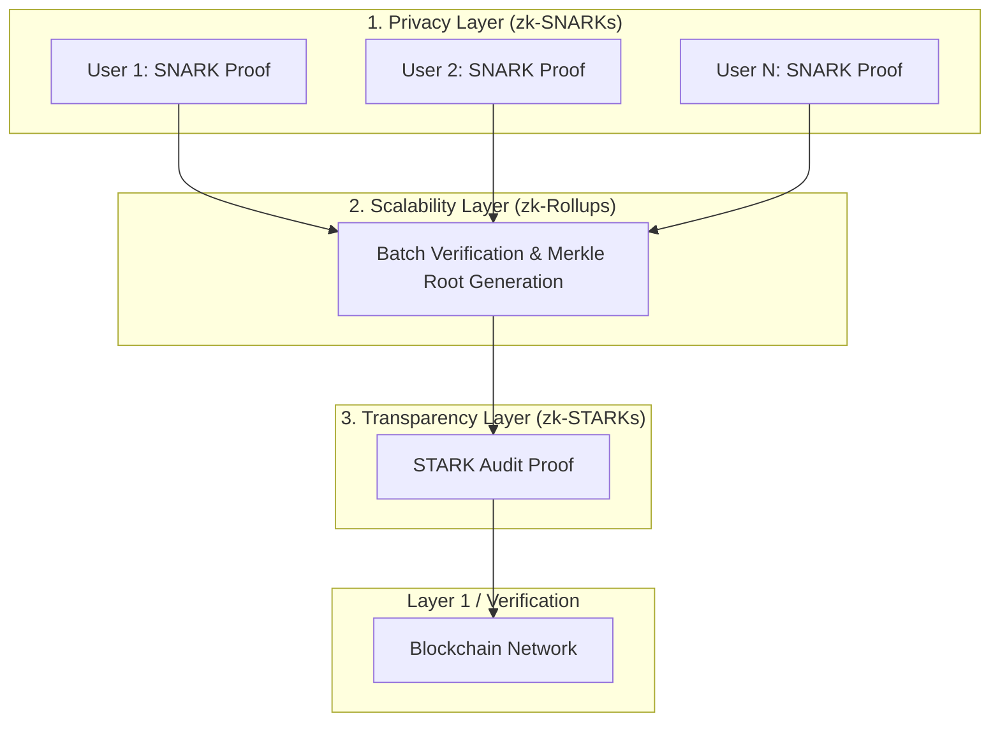

# 🛡️ Hybrid Zero-Knowledge Proof Verification Framework
*zk-SNARK, zk-STARK, zk-Rollup (2025)*

[](https://zkp-dashboard-c5xe.vercel.app/)
[](https://www.python.org/)
[](https://ethereum.org/)
[](https://nextjs.org/)

A cutting-edge, hybrid ZKP verification pipeline that enables **secure, scalable, and low-cost batch verification** for decentralized systems. This dashboard visualizes the integration and orchestration of various zero-knowledge proof technologies into a unified, high-performance execution layer.

---

## 📜 Academic Publication
> **Conference:** ICNTCS-26 (Virtual)  
> **Paper ID:** SFE 23567  
> *Extended journal version currently in preparation.*

---

## 🚀 [Live Production Dashboard](https://zkp-dashboard-c5xe.vercel.app/)
*Interact with the hybrid framework in real-time. No setup required.*

---

## 💎 Core Value Proposition

| Protocol Module | Purpose & Characteristics | Focus Area |
| :--- | :--- | :--- |
| **zk-SNARKs** | Individual privacy generation. Fast verification with succinct proof sizes. | **Privacy** |
| **zk-STARKs** | Post-quantum secure proof generation without a trusted setup. | **Transparency** |
| **zk-Rollups** | Batches multiple transactions into a single Merkle root to reduce gas costs. | **Scalability** |
| **Hybrid Framework** | Orchestrates SNARKs for privacy, Rollups for batching, and STARKs for auditing. | **Efficiency** |

---

## 🏗️ System Architecture

Our Hybrid ZKP Flow sequentially integrates privacy, batching, and auditing:



---

## 🛠️ Technology Stack

*   **Core Systems:** Python, Cryptography, Blockchain, zk-Rollups
*   **Web Dashboard:** Next.js 15 (App Router), React 19, Tailwind CSS
*   **ZKP Engine:** `snarkjs` & `circom` (Circuit compilation & proof generation)
*   **Backend Support:** Node.js, Express, TypeScript
*   **Database Integration:** MongoDB (Mongoose)

---

## ⚙️ Usage & Simulation

To experience the Hybrid Flow locally or through the live demo:

1. Navigate to the **Demo** page from the dashboard home.
2. Switch to the **Hybrid** tab within the application.
3. Select your preferred execution mode (Single, Multi, or Auto Batch).
4. Click **Start Hybrid Flow** to witness the seamless pipeline of SNARKs, Rollups, and STARKs.

---

## 📦 Local Development Setup

### 1. Synchronize the Repository
```bash
git clone https://github.com/Varshiniamara/zkp-dashboard.git
cd zkp-dashboard
```

### 2. Install Dependencies
*(Note: `--legacy-peer-deps` is required for React 19 UI component bounds)*
```bash
npm install --legacy-peer-deps
```

### 3. Environment Configuration
Create a backend environment file from the provided example template:
```bash
cp backend/example.env backend/.env
```

### 4. Launch the Hybrid Environment
Start both the Frontend UI and Backend ZKP API simultaneously:
```bash
npm run dev:full
```
*   **Dashboard**: `http://localhost:3000`
*   **ZKP Backend**: `http://localhost:5001`

---

> Built for the advancement of decentralized cryptography protocols.
